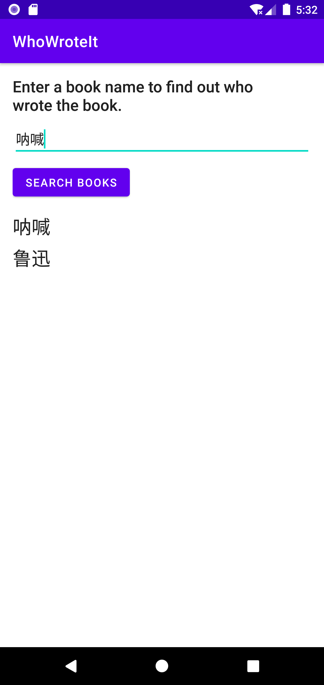
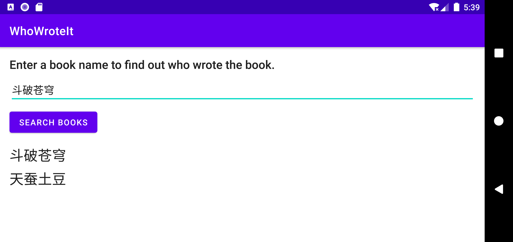

# Lab09. Background Tasks

## Practice:

- running screen shot

  -  initial page:

    

  - when entering empty search term:

    

    

  - search books and authors:

      ->        

  

  - after rotation(information preserved):

  


- running video

  


## Homework:

- running screen shot

  - initial page:

  

  

  - when entering empty web url:

    

    

  - get web page source code:

    


- running video:

  


## Key Code:

- NetworkUtils.java

```java
package com.example.getwebpagesourcecode;

import android.net.Uri;
import android.util.Log;

import java.io.BufferedReader;
import java.io.IOException;
import java.io.InputStream;
import java.io.InputStreamReader;
import java.lang.reflect.InvocationTargetException;
import java.lang.reflect.Method;
import java.net.HttpURLConnection;
import java.net.URL;
import java.net.URLConnection;

import javax.net.ssl.HttpsURLConnection;

public class NetworkUtils {
    private static final String LOG_TAG = com.example.getwebpagesourcecode.NetworkUtils.class.getSimpleName();
    // Base URL for Books API.
    private static final String HTTP_PROTO = "http://";
    private static final String HTTPS_PROTO = "https://";

    static String getSourceCode(String queryString, String protocol) {
        URLConnection urlConnection = null;
        BufferedReader reader = null;
        String sourceCodeString = null;

        try {
            Uri builtURI = Uri.parse(protocol + queryString);
            URL requestURL = new URL(builtURI.toString());

            if (protocol.equals(HTTP_PROTO)) {
                urlConnection = (HttpURLConnection) requestURL.openConnection();
            } else if (protocol.equals(HTTPS_PROTO)){
                urlConnection = (HttpsURLConnection) requestURL.openConnection();
            } else {
                // 两种协议都不是
                return null;
            }

            // 通过反射机制动态获取类方法并调用，避免代码冗余
            Class urlConnectionClass = urlConnection.getClass();
            Log.d(LOG_TAG, urlConnectionClass.toString());
            Method setRequestMethod = urlConnectionClass.getMethod("setRequestMethod", String.class);
            Log.d(LOG_TAG, setRequestMethod.toString());
            setRequestMethod.invoke(urlConnection, "GET");
            urlConnection.connect();

            // Get the InputStream.
            InputStream inputStream = urlConnection.getInputStream();
            // Create a buffered reader from that input stream.
            reader = new BufferedReader(new InputStreamReader(inputStream));
            // Use a StringBuilder to hold the incoming response.
            StringBuilder builder = new StringBuilder();
            // Read the input line-by-line into the string while there is still input.
            String line;
            while ((line = reader.readLine()) != null) {
                builder.append(line);
                // Since it's JSON, adding a newline isn't necessary (it won't
                // affect parsing) but it does make debugging a *lot* easier
                // if you print out the completed buffer for debugging.
                builder.append("\n");
            }
            if (builder.length() == 0) {
                // Stream was empty. No point in parsing.
                return null;
            }
            sourceCodeString = builder.toString();

        } catch (IOException | NoSuchMethodException | IllegalAccessException | InvocationTargetException e) {
            e.printStackTrace();
        } finally {
            if (urlConnection != null) {
                Class urlConnectionClass = urlConnection.getClass();
                Method disconnect = null;
                try {
                    disconnect = urlConnectionClass.getMethod("disconnect");
                } catch (NoSuchMethodException e) {
                    e.printStackTrace();
                }
                try {
                    disconnect.invoke(urlConnection);
                } catch (IllegalAccessException e) {
                    e.printStackTrace();
                } catch (InvocationTargetException e) {
                    e.printStackTrace();
                }
            }
            if (reader != null) {
                try {
                    reader.close();
                } catch (IOException e) {
                    e.printStackTrace();
                }
            }
        }

        Log.d(LOG_TAG, sourceCodeString);
        return sourceCodeString;
    }
}

```


- MainActivity.java

```java
package com.example.getwebpagesourcecode;

import androidx.annotation.NonNull;
import androidx.annotation.Nullable;
import androidx.appcompat.app.AppCompatActivity;
import androidx.loader.app.LoaderManager;
import androidx.loader.content.Loader;

import android.content.Context;
import android.net.ConnectivityManager;
import android.net.NetworkInfo;
import android.os.Bundle;
import android.util.Log;
import android.view.View;
import android.view.inputmethod.InputMethodManager;
import android.widget.AdapterView;
import android.widget.EditText;
import android.widget.Spinner;
import android.widget.TextView;

public class MainActivity extends AppCompatActivity
        implements LoaderManager.LoaderCallbacks<String> {
    private static final String LOG_TAG = com.example.getwebpagesourcecode.MainActivity.class.getSimpleName();
    private EditText mUrlInput;
    private Spinner mProtocolSelector;
    private TextView mPageContent;
    private String protocolString = "";

    @Override
    protected void onCreate(Bundle savedInstanceState) {
        super.onCreate(savedInstanceState);
        setContentView(R.layout.activity_main);

        mUrlInput = (EditText) findViewById(R.id.urlInput);
        mProtocolSelector = (Spinner) findViewById(R.id.protocolSelector);
        mPageContent = (TextView) findViewById(R.id.pageContent);
        protocolString = getResources().getStringArray(R.array.protocolArray)[0];

        if (getSupportLoaderManager().getLoader(0) != null) {
            getSupportLoaderManager().initLoader(0, null, this);
        }
    }

    public void searchURL(View view) {
        // Get the search string from the input field.
        String queryString = mUrlInput.getText().toString();
        // 获取用户选择的协议类型
        mProtocolSelector.setOnItemSelectedListener(new AdapterView.OnItemSelectedListener() {

            @Override
            public void onItemSelected(AdapterView<?> parent, View view, int position, long id) {
                protocolString = getResources().getStringArray(R.array.protocolArray)[position];
                Log.d(LOG_TAG, protocolString);
            }

            @Override
            public void onNothingSelected(AdapterView<?> parent) {

            }
        });
        InputMethodManager inputManager = (InputMethodManager)
                getSystemService(Context.INPUT_METHOD_SERVICE);

        // Hide the keyboard.
        if (inputManager != null) {
            inputManager.hideSoftInputFromWindow(view.getWindowToken(),
                    InputMethodManager.HIDE_NOT_ALWAYS);
        }

        // check network connection
        ConnectivityManager connMgr =
                (ConnectivityManager) getSystemService(Context.CONNECTIVITY_SERVICE);
        NetworkInfo networkInfo = null;
        if (connMgr != null) {
            networkInfo = connMgr.getActiveNetworkInfo();
        }

        if (networkInfo != null && networkInfo.isConnected() && queryString.length() != 0) {
            Bundle queryBundle = new Bundle();
            queryBundle.putString("queryString", queryString);
            queryBundle.putString("protocolString", protocolString);
            getSupportLoaderManager().restartLoader(0, queryBundle, this);
            mPageContent.setText(R.string.loading);
        } else {
            if (queryString.length() == 0) {
                mPageContent.setText(R.string.no_input_term);
            } else {
                mPageContent.setText(R.string.no_network);
            }
        }
    }

    @NonNull
    @Override
    public Loader<String> onCreateLoader(int id, @Nullable Bundle args) {
        String queryString = "";

        if (args != null) {
            queryString = args.getString("queryString");
        }

        return new WebLoader(this, queryString, protocolString);
    }

    @Override
    public void onLoadFinished(@NonNull Loader<String> loader, String data) {
        if (data != null && !data.equals("")) {
            mPageContent.setText(data);
        } else {
            mPageContent.setText(R.string.no_result);
        }

    }

    @Override
    public void onLoaderReset(@NonNull Loader<String> loader) {

    }
}
```


- WebLoader.java

```java
package com.example.getwebpagesourcecode;

import android.content.Context;

import androidx.annotation.NonNull;
import androidx.annotation.Nullable;
import androidx.loader.content.AsyncTaskLoader;

public class WebLoader extends AsyncTaskLoader<String> {
    private String mQueryString;
    private String mProtocolString;

    public WebLoader(@NonNull Context context, String queryString, String protocolString) {
        super(context);
        mQueryString = queryString;
        mProtocolString = protocolString;
    }

    @Nullable
    @Override
    public String loadInBackground() {
        return NetworkUtils.getSourceCode(mQueryString, mProtocolString);
    }

    @Override
    protected void onStartLoading() {
        super.onStartLoading();
        forceLoad();
    }

}

```


