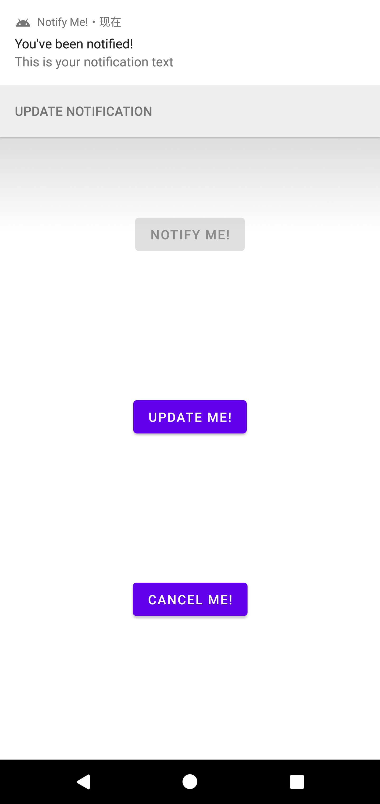
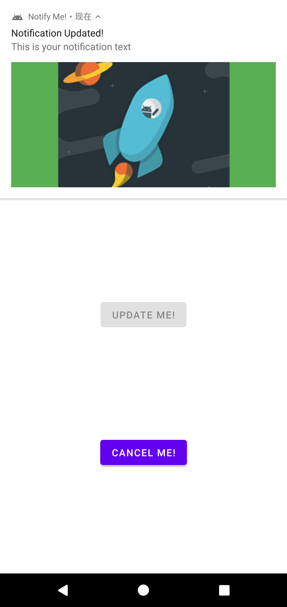
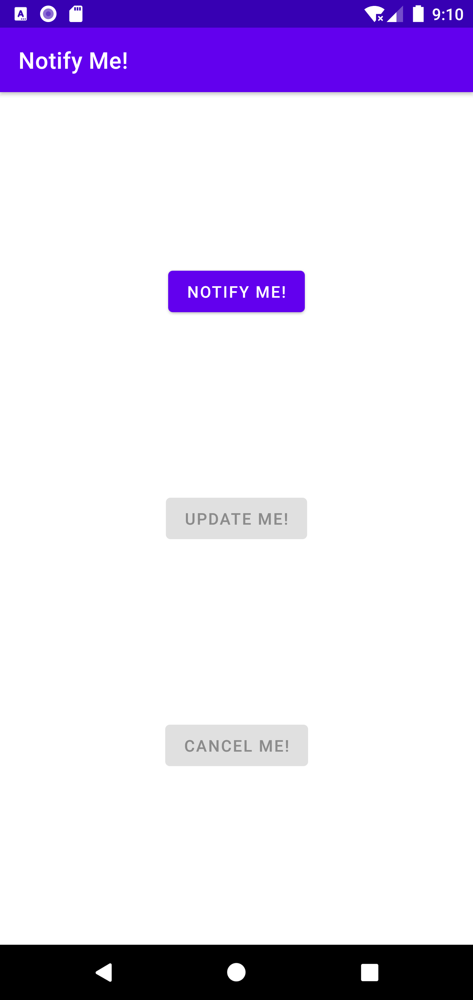
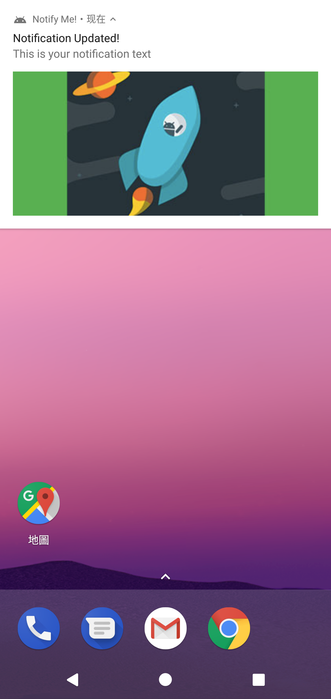
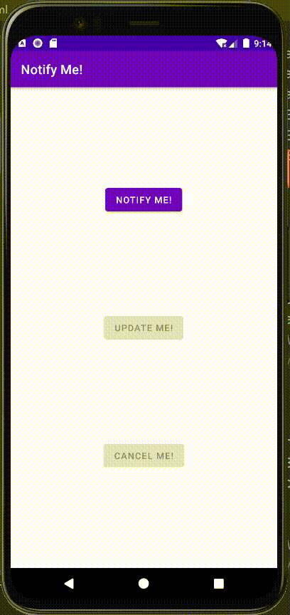
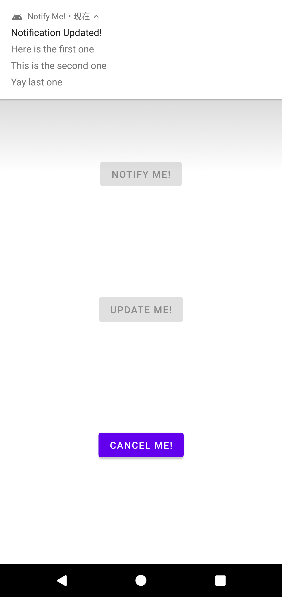
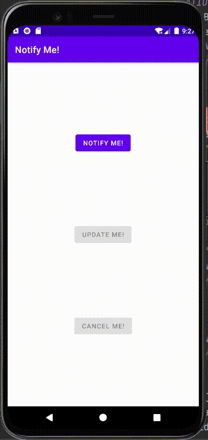

# Lab10. Notification

## Practice:

- running screen shot

  -  click "Notify Me!":

    

  - click "Update Me!":

    

    

  - click "Cancel Me!":

  

  

  - update within notification:

  


- running video

  


## Homework:

- running screen shot

  - InboxStyle update:

  


- running video:

  


## Key Code:

- MainActivity.java

```java
package com.example.notifyme;

import androidx.appcompat.app.AppCompatActivity;
import androidx.core.app.NotificationBuilderWithBuilderAccessor;
import androidx.core.app.NotificationCompat;

import android.app.NotificationChannel;
import android.app.NotificationManager;
import android.app.PendingIntent;
import android.content.BroadcastReceiver;
import android.content.Context;
import android.content.Intent;
import android.content.IntentFilter;
import android.graphics.Bitmap;
import android.graphics.BitmapFactory;
import android.graphics.Color;
import android.os.Build;
import android.os.Bundle;
import android.view.View;
import android.widget.Button;

public class MainActivity extends AppCompatActivity {
    private static final String ACTION_UPDATE_NOTIFICATION =
            "com.example.notifyme.ACTION_UPDATE_NOTIFICATION";
    private static final String PRIVACY_CHANNEL_ID = "primary_notification_channel";
    private static final int NOTIFICATION_ID = 0;
    private NotificationManager mNotifyManager;
    private Button button_notify;
    private Button button_cancel;
    private Button button_update;
    private NotificationReceiver mReceiver = new NotificationReceiver();

    @Override
    protected void onCreate(Bundle savedInstanceState) {
        super.onCreate(savedInstanceState);
        setContentView(R.layout.activity_main);

        button_notify = findViewById(R.id.notify);
        button_notify.setOnClickListener(new View.OnClickListener() {

            @Override
            public void onClick(View v) {
                sendNotification();
            }
        });

        button_update = findViewById(R.id.update);
        button_update.setOnClickListener(new View.OnClickListener() {
            @Override
            public void onClick(View v) {
                // Update the notification
                updateNotification();
            }
        });

        button_cancel = findViewById(R.id.cancel);
        button_cancel.setOnClickListener(new View.OnClickListener() {
            @Override
            public void onClick(View v) {
                // Cancel the notification
                cancelNotification();
            }
        });

        setNotificationButtonState(true, false, false);
        registerReceiver(mReceiver, new IntentFilter(ACTION_UPDATE_NOTIFICATION));
        createNotificationChannel();
    }

    @Override
    protected void onDestroy(){
        unregisterReceiver(mReceiver);
        super.onDestroy();
    }

    void setNotificationButtonState(Boolean isNotifyEnabled,
                                    Boolean isUpdateEnabled,
                                    Boolean isCancelEnabled) {
        button_notify.setEnabled(isNotifyEnabled);
        button_update.setEnabled(isUpdateEnabled);
        button_cancel.setEnabled(isCancelEnabled);
    }

    public void sendNotification() {
        Intent updateIntent = new Intent(ACTION_UPDATE_NOTIFICATION);
        PendingIntent updatePendingIntent = PendingIntent.getBroadcast
                (this, NOTIFICATION_ID, updateIntent, PendingIntent.FLAG_ONE_SHOT);
        NotificationCompat.Builder notifyBuilder = getNotificationBuilder();
        notifyBuilder.addAction(R.drawable.ic_update, "Update Notification", updatePendingIntent);
        mNotifyManager.notify(NOTIFICATION_ID, notifyBuilder.build());
        setNotificationButtonState(false, true, true);
    }

    public void updateNotification(){
//        Bitmap androidImage = BitmapFactory.decodeResource(getResources(), R.drawable.mascot_1);
        NotificationCompat.Builder notifyBuilder = getNotificationBuilder();
//        notifyBuilder.setStyle(new NotificationCompat.BigPictureStyle()
//                .bigPicture(androidImage)
//                .setBigContentTitle("Notification Updated!"));
        notifyBuilder.setStyle(new NotificationCompat.InboxStyle()
                .addLine("Here is the first one")
                .addLine("This is the second one")
                .addLine("Yay last one")
                .setBigContentTitle("Notification Updated!"));
        mNotifyManager.notify(NOTIFICATION_ID, notifyBuilder.build());
        setNotificationButtonState(false, false, true);
    }

    public void cancelNotification(){
        mNotifyManager.cancel(NOTIFICATION_ID);
        setNotificationButtonState(true, false, false);
    }

    public void createNotificationChannel() {
        mNotifyManager = (NotificationManager) getSystemService(NOTIFICATION_SERVICE);
        if (Build.VERSION.SDK_INT >= Build.VERSION_CODES.O) {
            // create a NotificationChannel
            NotificationChannel notificationChannel = new NotificationChannel(PRIVACY_CHANNEL_ID,
                    "Mascot Notification", NotificationManager.IMPORTANCE_HIGH);

            notificationChannel.enableLights(true);
            notificationChannel.setLightColor(Color.RED);
            notificationChannel.enableVibration(true);
            notificationChannel.setDescription("Notification from Mascot");
            mNotifyManager.createNotificationChannel(notificationChannel);
        }
    }

    private NotificationCompat.Builder getNotificationBuilder() {
        Intent notificationIntent = new Intent(this, MainActivity.class);
        PendingIntent notificationPendingIntent = PendingIntent.getActivity(this,
                NOTIFICATION_ID, notificationIntent, PendingIntent.FLAG_UPDATE_CURRENT);
        NotificationCompat.Builder notifyBuilder =
                new NotificationCompat.Builder(this, PRIVACY_CHANNEL_ID)
                        .setContentTitle("You've been notified!")
                        .setContentText("This is your notification text")
                        .setSmallIcon(R.drawable.ic_android)
                        .setContentIntent(notificationPendingIntent)
                        .setAutoCancel(true)
                        .setPriority(NotificationCompat.PRIORITY_HIGH)
                        .setDefaults(NotificationCompat.DEFAULT_ALL);

        return notifyBuilder;
    }

    public class NotificationReceiver extends BroadcastReceiver {

        public NotificationReceiver() {
        }

        @Override
        public void onReceive(Context context, Intent intent) {
            // Update the notification
            updateNotification();
        }
    }
}
```


