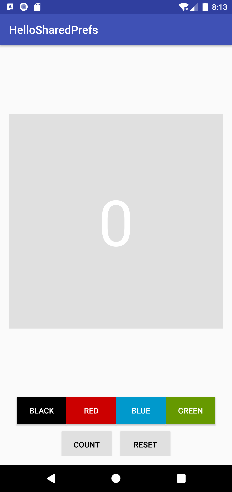
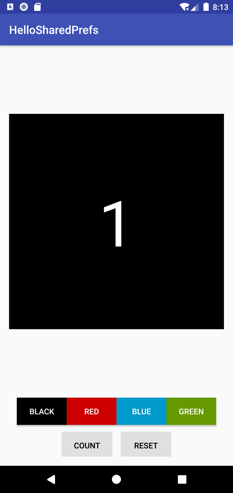
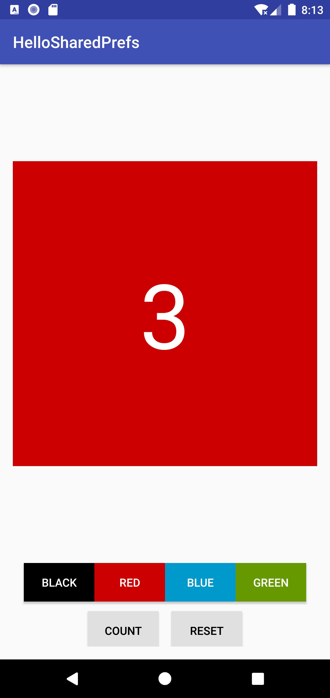
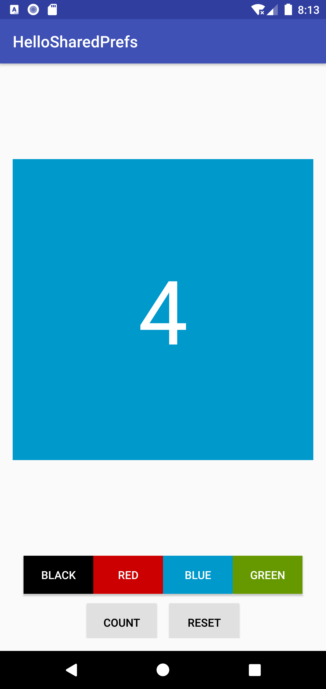
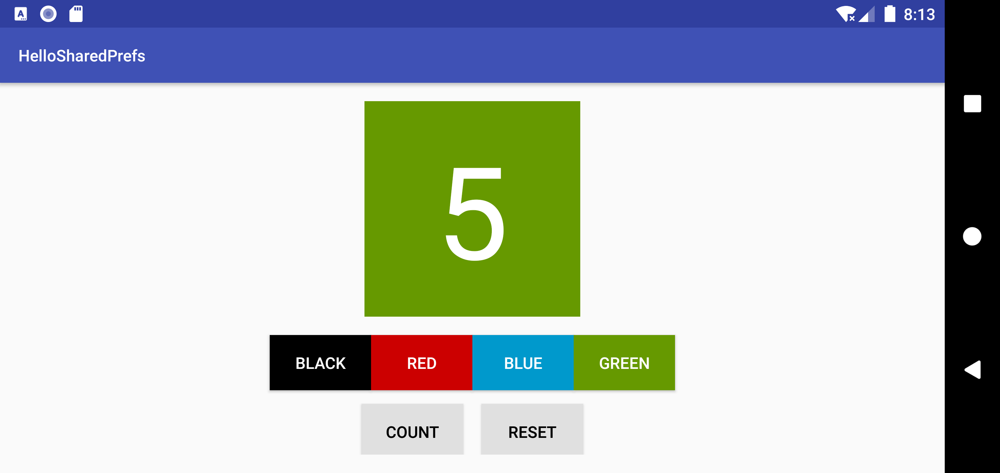
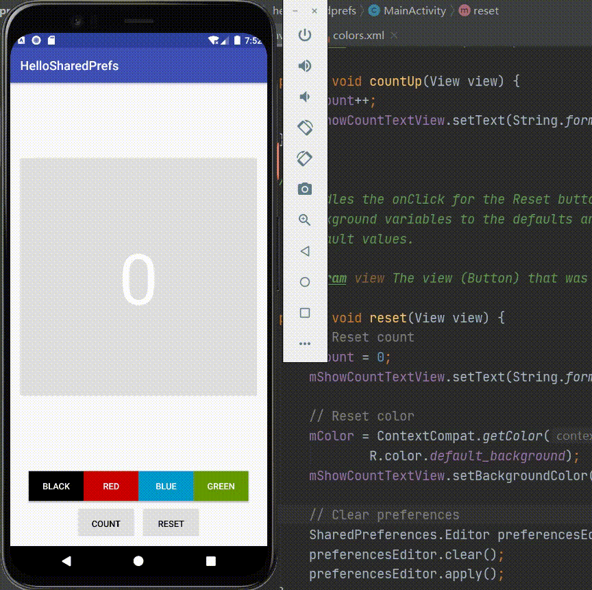
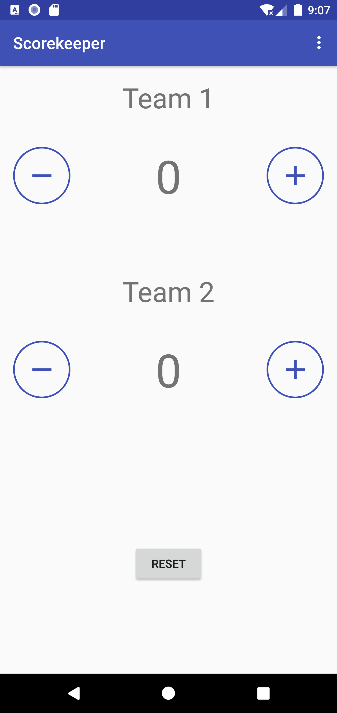
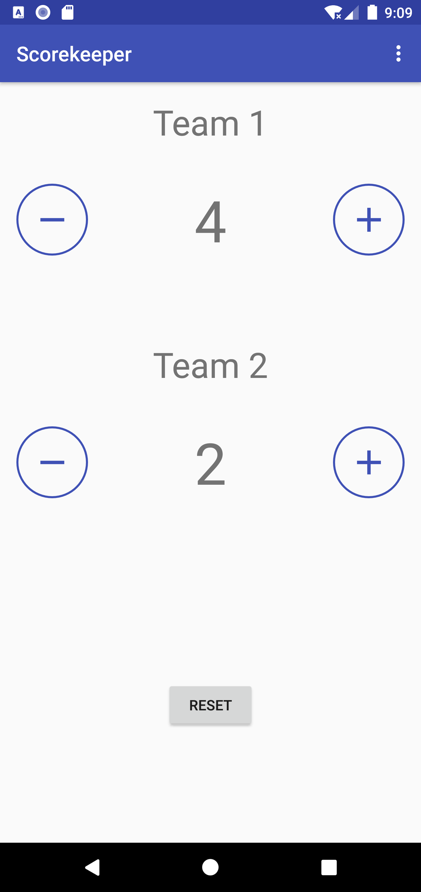
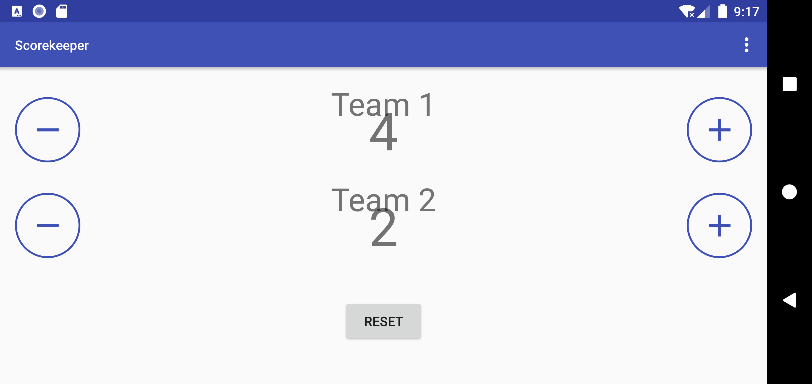
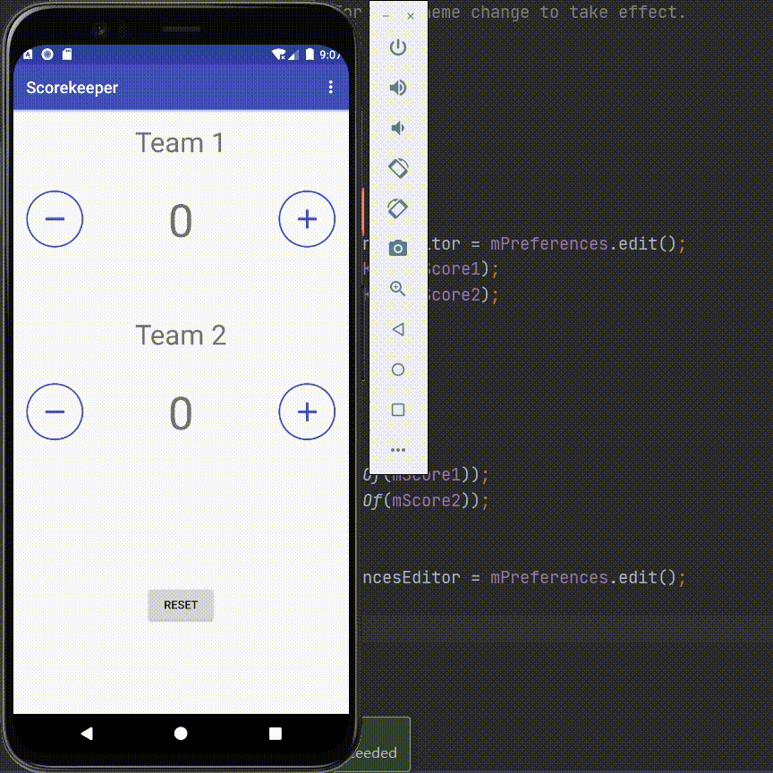

# Lab11. Shared Preferences

## Practice:

- running screen shot

  - increase count and change background color

       

    

  - after rotation:

    

    

  - preserved status is shown in the video


- running video

  


## Homework:

- running screen shot

  - increase and decrease scores of different teams:

   
  
  
  
     - after rotation:
  
        
  
       
  
  - preserved status is shown in the video


- running video:

  


## Key Code:

- MainActivity.java

```java
/*
 * Copyright (C) 2018 Google Inc.
 *
 * Licensed under the Apache License, Version 2.0 (the "License");
 * you may not use this file except in compliance with the License.
 * You may obtain a copy of the License at
 *
 *     http://www.apache.org/licenses/LICENSE-2.0
 *
 * Unless required by applicable law or agreed to in writing, software
 * distributed under the License is distributed on an "AS IS" BASIS,
 * WITHOUT WARRANTIES OR CONDITIONS OF ANY KIND, either express or implied.
 * See the License for the specific language governing permissions and
 * limitations under the License.
 */

package com.example.android.scorekeeper;

import android.content.SharedPreferences;
import android.os.Bundle;
import android.support.v4.content.ContextCompat;
import android.support.v7.app.AppCompatActivity;
import android.support.v7.app.AppCompatDelegate;
import android.view.Menu;
import android.view.MenuItem;
import android.view.View;
import android.widget.TextView;

/***
 * Main Activity for the Scorekeeper app, which keeps score for any game
 * involving two teams. The user can increment or decrement the score
 * for each team using Button views.
 */
public class MainActivity extends AppCompatActivity {

    // Member variables for holding the score
    private int mScore1;
    private int mScore2;

    // Member variables for the two score TextView elements
    private TextView mScoreText1;
    private TextView mScoreText2;

    // Tags to be used as the keys in OnSavedInstanceState
    static final String STATE_SCORE_1 = "Team 1 Score";
    static final String STATE_SCORE_2 = "Team 2 Score";

    // Key for current score1
    private final String SCORE1_KEY = "score1";
    // Key for current score2
    private final String SCORE2_KEY = "score2";

    private SharedPreferences mPreferences;
    private String sharedPrefFile = "com.example.android.scorekeeper";

    @Override
    protected void onCreate(Bundle savedInstanceState) {
        super.onCreate(savedInstanceState);
        setContentView(R.layout.activity_main);

        //Find the TextViews by ID
        mScoreText1 = findViewById(R.id.score_1);
        mScoreText2 = findViewById(R.id.score_2);
        mPreferences = getSharedPreferences(sharedPrefFile, MODE_PRIVATE);

        // Restore preferences
        mScore1 = mPreferences.getInt(SCORE1_KEY, 0);
        mScoreText1.setText(String.valueOf(mScore1));
        mScore2 = mPreferences.getInt(SCORE2_KEY, 0);
        mScoreText2.setText(String.valueOf(mScore2));
    }

    /**
     * Handles the onClick of both the decrement buttons.
     *
     * @param view The button view that was clicked
     */
    public void decreaseScore(View view) {
        // Get the ID of the button that was clicked.
        int viewID = view.getId();
        switch (viewID) {
            // If it was on Team 1:
            case R.id.decreaseTeam1:
                // Decrement the score and update the TextView.
                mScore1--;
                mScoreText1.setText(String.valueOf(mScore1));
                break;
            // If it was Team 2:
            case R.id.decreaseTeam2:
                // Decrement the score and update the TextView.
                mScore2--;
                mScoreText2.setText(String.valueOf(mScore2));
        }
    }

    /**
     * Handles the onClick of both the increment buttons.
     *
     * @param view The button view that was clicked
     */
    public void increaseScore(View view) {
        // Get the ID of the button that was clicked.
        int viewID = view.getId();
        switch (viewID) {
            // If it was on Team 1:
            case R.id.increaseTeam1:
                // Increment the score and update the TextView.
                mScore1++;
                mScoreText1.setText(String.valueOf(mScore1));
                break;
            // If it was Team 2:
            case R.id.increaseTeam2:
                // Increment the score and update the TextView.
                mScore2++;
                mScoreText2.setText(String.valueOf(mScore2));
        }
    }

    /**
     * Creates the night mode menu option.
     *
     * @param menu The menu in the action bar
     * @return True to display the menu, false to hide it
     */
    @Override
    public boolean onCreateOptionsMenu(Menu menu) {
        getMenuInflater().inflate(R.menu.main_menu, menu);
        // Change the label of the menu based on the state of the app.
        int nightMode = AppCompatDelegate.getDefaultNightMode();
        if(nightMode == AppCompatDelegate.MODE_NIGHT_YES){
            menu.findItem(R.id.night_mode).setTitle(R.string.day_mode);
        } else{
            menu.findItem(R.id.night_mode).setTitle(R.string.night_mode);
        }
        return true;
    }


    /**
     * Handles options menu item clicks.
     *
     * @param item The item that was pressed
     * @return returns true since the item click wa handled
     */
    @Override
    public boolean onOptionsItemSelected(MenuItem item) {
        // Check if the correct item was clicked.
        if (item.getItemId() == R.id.night_mode) {
            // Get the night mode state of the app.
            int nightMode = AppCompatDelegate.getDefaultNightMode();
            // Set the theme mode for the restarted activity.
            if (nightMode == AppCompatDelegate.MODE_NIGHT_YES) {
                AppCompatDelegate.setDefaultNightMode
                        (AppCompatDelegate.MODE_NIGHT_NO);
            } else {
                AppCompatDelegate.setDefaultNightMode
                        (AppCompatDelegate.MODE_NIGHT_YES);
            }
            // Recreate the activity for the theme change to take effect.
            recreate();
        }
        return true;
    }

    @Override
    protected void onPause(){
        super.onPause();
        SharedPreferences.Editor preferencesEditor = mPreferences.edit();
        preferencesEditor.putInt(SCORE1_KEY, mScore1);
        preferencesEditor.putInt(SCORE2_KEY, mScore2);
        preferencesEditor.apply();
    }

    public void reset(View view) {
        // Reset score1, score2
        mScore1 = mScore2 = 0;
        mScoreText1.setText(String.valueOf(mScore1));
        mScoreText2.setText(String.valueOf(mScore2));

        // Clear preferences
        SharedPreferences.Editor preferencesEditor = mPreferences.edit();
        preferencesEditor.clear();
        preferencesEditor.apply();
    }
}
```


